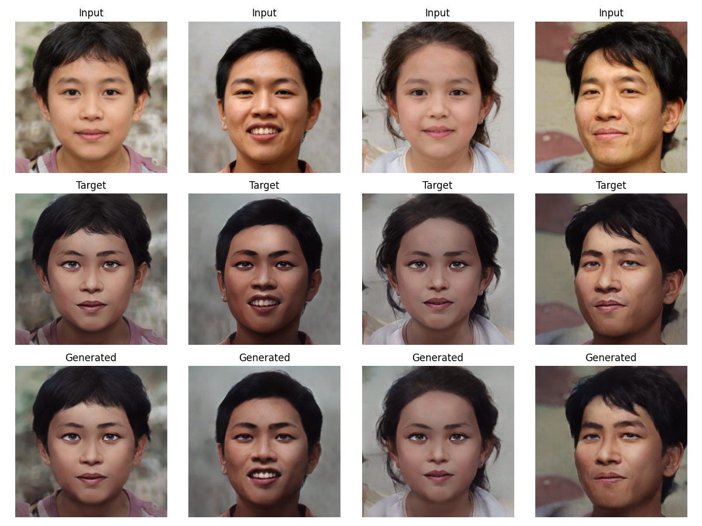

#### 项目说明
```text
     双城之战主角金克斯有句台词是“我有最美好的初衷”奈何却总是好心办了“坏事”。而
  希尔科最初因为与范德尔选择了不同的道路而决裂了，但到最后的时候希尔科却越来越像
  范德尔。希尔科最后对金克斯说的“你，我什么都不换”更是让无数玩家泪崩。
  出于对双城之战画风的喜爱，本项目将利用Pix2Pix网络实现双城之战动画进行风格迁移，并进行一定的改进。
```
#### 项目文件说明
<pre>
  train.py            ---模型训练入口<br>
  test.py             ---模型测试入口<br>
  test_visual.py      ---可视化模型测试入口<br>
  loss.py             ---损失函数<br>
  p2pconfigs.py       ---项目配置文件<br>
  pix2pix.py          ---模型网络<br>
  extra_networks.py   ---辅助模型增强模块<br>
  DataManager.py      ---数据处理模块<br>
  FID_evaluation.py    ---FID计算<br>  
  tool.py             ---自定义辅助功能<br>
  environment.yml     ---conda环境配置文件
</pre>
<br>


#### 开发运行环境
1. R7-5800H
2. Nvidia-Rtx3070Q

#### 模型运行说明
1. ``请确保你的环境可以满足配置需求``
<br><br>
2. ``conda env create -f environment.yml --name your_env_name  &nbsp;&nbsp;&nbsp;&nbsp;conda创建你的python环境``
<br><br>
3. ``conda activate your_env_name &nbsp;&nbsp;激活conda环境``
<br><br>
4. ``python train.py &nbsp;&nbsp;开始训练``
<br><br>
5. ``python test.py &nbsp;&nbsp;开始测试``
<br><br>
6. ``python test_visual.py &nbsp;&nbsp;启动可视化测试``
<br><br>
7. ``python FID_evaluation.py &nbsp;&nbsp;启动FID计算``
`
### 效果展示


